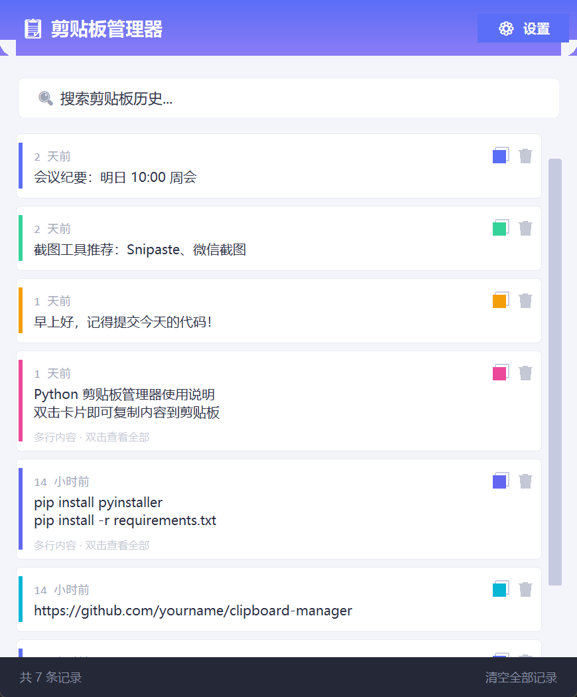

<div align="center">

# 📋 剪贴板管理器

**Clipboard Manager · 一个轻量、美观的 Windows 剪贴板历史记录工具**

后台自动保存你复制过的所有内容，支持搜索、一键复制、自动清理与系统托盘常驻。

[](CHANGELOG.md)
[](LICENSE)
[]()
[]()
[]()
[](CONTRIBUTING.md)

</div>

---

## ✨ 功能特性

- 🗂️ **后台自动记录**：实时监控剪贴板，自动保存所有复制内容，带时间戳
- 🔍 **即时搜索**：输入关键字即可在历史记录中检索
- 📋 **一键复制**：双击卡片或点击复制按钮，随时取回任意历史内容
- 🗑️ **删除与清空**：单条删除，或一键清空全部记录
- ⏰ **自动清理**：可设置保留 7 / 30 / 90 天，过期记录自动清除
- 🖥️ **系统托盘**：关闭窗口自动收进托盘，后台常驻
- 🎨 **现代界面**：圆角卡片、渐变标题栏、高 DPI 高清显示
- 🖱️ **贴心交互**：自定义滚动条、悬停高亮与悬浮提示
- 🔒 **单实例运行**：重复启动自动唤出已运行的主窗口

## 📷 截图



## 🚀 快速开始

### 方式一：直接使用（推荐）

从 [Releases](https://github.com/ciyuana71/clipboard-manager/releases) 下载 `ClipboardManager.exe`，双击即可运行，无需安装 Python。

### 方式二：源码运行

```bash
git clone https://github.com/ciyuana71/clipboard-manager.git
cd clipboard-manager
pip install -r requirements.txt

# 运行（有终端窗口）
python clipboard_manager.py

# 或双击 clipboard_manager.pyw 无窗口后台启动
```

Windows 用户也可以直接双击 `setup.bat` 一键安装依赖并启动。

## 📦 打包为 EXE

```bash
pip install -r requirements.txt pyinstaller
pyinstaller ClipboardManager.spec --noconfirm
```

打包完成后，可执行文件位于 `dist/ClipboardManager.exe`。

> 也可通过 GitHub Actions 自动构建（见 [.github/workflows/build.yml](.github/workflows/build.yml)）。

## 🗂️ 目录结构

```
clipboard-manager/
├── .github/                  # GitHub 相关配置
│   ├── workflows/
│   │   └── build.yml         # CI：自动打包 exe
│   ├── ISSUE_TEMPLATE/       # Issue 模板
│   └── PULL_REQUEST_TEMPLATE.md
├── docs/
│   └── screenshot.png        # 界面截图
├── clipboard_manager.py      # 主程序（单文件源码）
├── clipboard_manager.pyw     # 无窗口启动器
├── requirements.txt          # Python 依赖
├── setup.bat                 # 一键安装依赖并启动
├── icon.ico                  # 程序图标
├── ClipboardManager.spec     # PyInstaller 打包配置
├── CHANGELOG.md              # 更新日志
├── CONTRIBUTING.md           # 贡献指南
└── LICENSE                   # MIT 许可证
```

## 🛠️ 技术栈

| 组件 | 说明 |
| --- | --- |
| Python 3.10+ | 开发语言 |
| Tkinter | 界面（原生 GUI） |
| SQLite | 历史记录存储 |
| [pyperclip](https://pypi.org/project/pyperclip/) | 剪贴板读写 |
| [pystray](https://pypi.org/project/pystray/) | 系统托盘 |
| [Pillow](https://pypi.org/project/Pillow/) | 托盘图标生成 |
| [PyInstaller](https://pyinstaller.org/) | 打包为独立 exe |

## 🤝 贡献

欢迎任何形式的贡献！请阅读 [CONTRIBUTING.md](CONTRIBUTING.md) 了解开发与提交流程。

## 📄 许可证

本项目基于 [MIT License](LICENSE) 开源。
